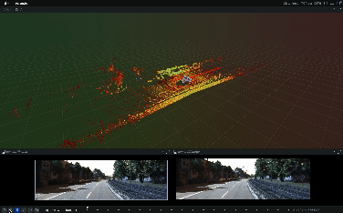
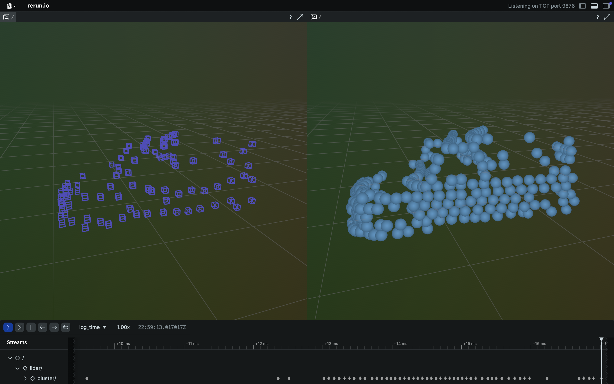

# Point Cloud Processing

## Kitti dataset visualization w/ Rerun


## Segmentation


## Clustering


## Voxel Grid filter


## Training data collector
Raw design: display each cluster * frames in rerun, then use user console input as the label.
- NONE : -1
- CAR : 0
- PEDESTRIAN : 1
- CYCLIST : 2

Store each cluster as a individual ```cluser{i}.npz``` file

With:
```
    voxels=[3, D, H, W],            #voxel grid input
    view_angle=[2,],        #[sin(az), cos(az)]
    centroid=[3,]       #[x, y, z]
    label=scalar,             #class index
    bbox=[5,]              #[w, h, l, sin(yaw), cos(yaw)]
```
## Voxel Multitask Net
### Architecture
```
         [Voxel Grid Input: B x 3 x D x H x W]
                        |
                [3D CNN Encoder]
                        |
             [Global Feature: B x F] ← AdaptiveAvgPool3d
                        |
      +-----------------+------------------+
      |                                    |
[B x F]                         [View Direction (B x 2) + Centroid (B x 3): B x 5]
                                       |
                            [View MLP → B x 64]
                                       |
      +-----------------+------------------+
                        |
         [Fused Feature: B x (F + 64)]
                        |
      +-----------------+------------------+
      |                                    |
[Classifier Head]                   [Bounding Box Head]
      |                                    |
 [B x num_classes]         [B x 5] → [w, h, l, sin(yaw), cos(yaw)]
```
**input:**
```
    voxels=[3, D, H, W],            #voxel grid input
    view_angle=[2,],        #[sin(az), cos(az)]
    centroid=[3,]       #[x, y, z]
```
**output:**
```
    label=scalar
    bbox=[5,] #[w, h, l, sin(yaw), cos(yaw)]
```


## TODO:
- [x] Point cloud segementation
- [x] Clustering
- [x] Filters
- [ ] Training data collecting pipeline
- [ ] Implement point cloud recognition (mmdetection3D or Pytorch or VoxelNet)
- [ ] Project camera data to point clouds
